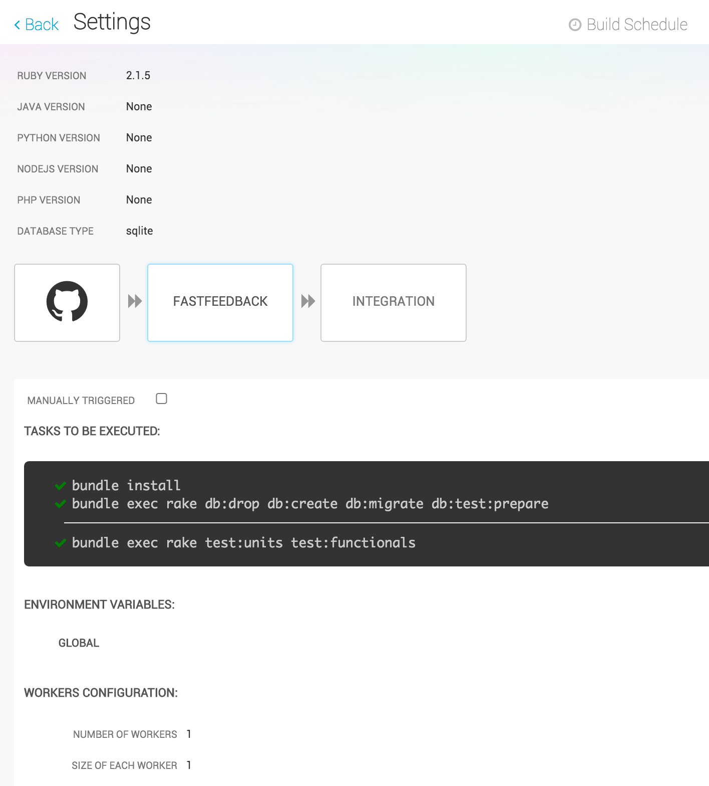

##DevOps TechTalk - Snap CI
---
###Team Members:
* Kelei Gong
* Ying Huang
* Shanil Puri
* Shengpei Zhang

##Setup
###Add a repository
Login to [Snap CI](https://snap-ci.com/), GitHub will ask if you want to give a set of permissions to Snap. Snap will present a list of all the repositories you have access to, and then you can add a repository to Snap
###Configure the build steps
After adding the repository to Snap, it will clone the repository form Github to its cloud server, and then we can customize the build steps for this repository.

Snap will attempt to automatically detect some popular configurations for the build. It looks for languages versions, build tools files, dependency managers and other conventions that may indicate how the build could be set up.

For example, if we import a Rails project, it will get the language version and database type, then automatically create two steps for pipeline: FastFeedBack and Integration.

 

In this example, it will run the basic setup for the Rails project, then run unit test and functional test. We can customize this step by changing the commands to be executed, 