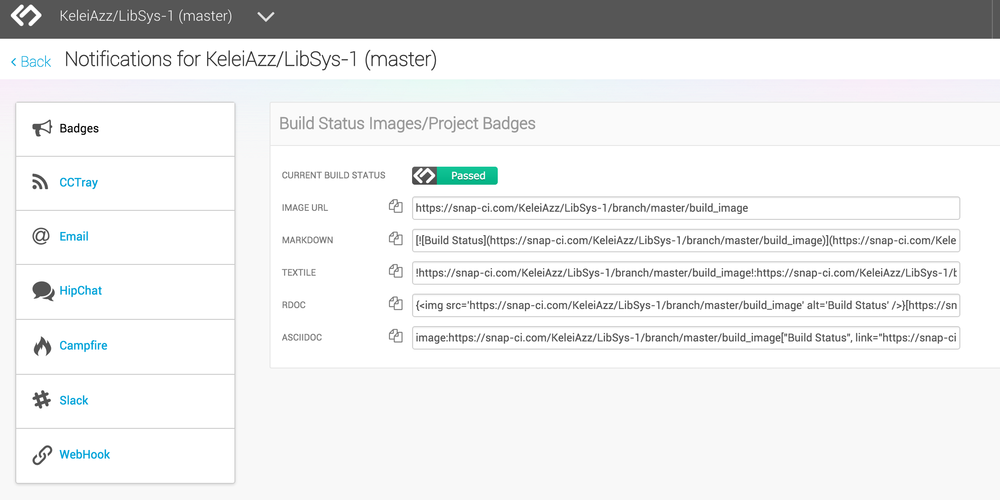

##DevOps TechTalk - Snap CI
---
###Team Members:
* Kelei Gong
* Ying Huang
* Shanil Puri
* Shengpei Zhang

### Demo
[video](https://drive.google.com/file/d/0B87f7178bIHnX08wRmFOZl9uLW8/view?usp=sharing)

[slides](https://docs.google.com/presentation/d/1ycscxHwlHiRSbv9tKpJLLXmphNAAxStxDyeYeBX8VeA/edit#slide=id.p)

##Overview
###Programming Language Support
Snap supports many [programming languages](https://docs.snap-ci.com/the-ci-environment/languages/) and automated build systems for them. For Java, for instance, it supports Java 6, 7, and 8, and, for build tools, Maven and Ant. For Ruby, it supports bundler and rake.

It can automatically detect which build tools are used in the project, for certain build tools. For instance, if a pom.xml file is present in a Java project, Snap CI can automatically configure itself for Rails project, it will detect the database type and create two build and test stages in the pipeline.

###GitHub Integration
Snap integrates closely with GitHub. GitHub is of course very popular for both open-source and closed-source software projects in many programming languages. So, Snap focusing its efforts on GitHub makes sense for anyone using GitHub.

Snap by default triggers a build whenever a push is made to the user's GitHub repository, including any Git branch. When a commit is made to a branch, it can also attempt to merge the branch with the master branch, and report the results.

Snap also tracks pull requests. It runs a build to show what the result would be if the pull is merged.
An email is sent to developers whenever a build fails.
###Pipelines
Snap allows a series of customized steps whenever it evaluates a build. The steps together are called a "pipeline". They can report different test information (pass or fail, the specific fail position) about your repository. What is more, you can even assign deployment of the software to testing or production environments, and the execution of either automatic or manual tests against these deployed environments.

Many continuous integration tools have the feature of building the software and running tests when a change happens. However, Snap augments this feature with the ideas of "deployment pipelines" and "continuous delivery". Snap can in this manner perform more steps than other tools.
* Continuous Integration - The automated build and test of your software when a change is made by anyone on the team, with all work happening on a shared branch.
* Continuous Delivery - The ability to keep your software easily packaged at any time. Have a rigorous set of automated tests and robust deployment scripts and tools.

Each step in the pipeline is at the core a series of command-line commands on the Snap server. The console output is shown for each step. If a step fails, the pipeline will halt; the later steps will not execute.

Both automatic and manual steps are allowed. One would normally want to run most of the tests automatically with each Git commit, and perhaps deploy the software to a test environment. However, a step can also perform a release of the software, which normally one would only want to run manually, not with each commit. For instance, a step may deploy a web application to Heroku or Amazon Web Services. It may also upload a software release file in its final form to a web site for distribution, such as to SourceForge or the project's GitHub releases page. The final "publish" stage will not be executed unless someone manually triggers it. It means any changes made to the project will not be put into the production version automatically, which reduces the risks.

At the end of a series of stages you can deploy your software to production. It can be configured to deploy to AWS and Heroku with several clicks.
##Setup
###Add a repository
Login to [Snap CI](https://snap-ci.com/), GitHub will ask if you want to give a set of permissions to Snap. Snap will present a list of all the repositories you have access to, and then you can add a repository to Snap
###Configure the build steps
After adding the repository to Snap, it will clone the repository form Github to its cloud server, and then we can customize the build steps for this repository.

Snap will attempt to automatically detect some popular configurations for the build. It looks for languages versions, build tools files, dependency managers and other conventions that may indicate how the build could be set up.

For example, if we import a Rails project, it will get the language version and database type, then automatically create two steps for pipeline: FastFeedBack and Integration.

 

In this example, it will run the basic setup for the Rails project, follows by unit test and functional test. We can customize this step by changing the commands to be executed, and add more stages to the pipeline. The stage trigger can be set to be either automatic or manual.  

Some additional settings like `Environment Variables` and `Secure Files` can give us more control over the building steps. And an important feature of Snap is that we can set the number of workers and the worker's size of this stage, thus it can run this stage in parallel or run multiple pipelines in parallel. One way of taking advantage of this is to run tests in parallel across multiple workers. And with larger size workers be useful in cases where the stage requires more memory to build.

###Add a Deploy stage
Besides the building and testing parts in the pipeline, we can also add a Deploy stage, here we take deploy to Heroku as an example.

The configuration is quite easy, it will redirect you to Heroku and ask for authorization, then choose an application name and check the perform DB migration if it's a production stage. At last, You can optionally setup heroku configuration variables from Snap by navigating to the `Heroku Config Variables` tab

##Running the pipeline
###Basic usage
Upon finishing all the settings, we can start running the building pipeline. Any changes in the current branch will trigger a build, and followed by the deployment. The building process looks like this, it has a nice GUI to show the process of each stage, and we can click a stage to view it's console output, thus can make us have more aware of what is going on.

And we can see from the picture below, in this build it has two workers, in this way it can run the unit test and functional test in a parallel way.

###Branch tracking
By default Snap tracks master branch, but it can be setup to track any other branches.This helps resolve merge conflicts early. It will always tells status of branch with current base branch. 

In the `Automatic branch tracking` setting page, we can set branches with a certain prefix to be tracked, when changes are made to the tracked branches and an integration branch target (in this case the master branch), which will be used to set up an integration pipeline. Snap will run the same pipeline as master branch but without the deploy step. And when the build and test complete successfully, it will try to merge it to the master branch and run the build pipeline again.

###Pull requests
For any repository that is building on Snap CI, creating a new pull request on GitHub will create a project in Snap that will actively track that pull request, and update the status on the pull request on GitHub.

Once a pull request is created, it will trigger a build in Snap, and the build pipeline is identical to the master branch. 

We can view the status of this pull request in Github pull request page:

###Notification
Whenever the pipeline passes or fails, Snap will send a notification to the user, it can be set in the configuration page, and there are 7 ways of notification in total.

##Limitations
1. One-click deployment is available for AWS and Heroku only. Major providers such as Azure and DigitalOcean not supported. 
2. Cannot sync with other project host other than Github, e.g. Bitbucket.
3. No IDE integration.

##Conclusion
Snap CI has many advantages as a continuous integration tool. It is easy to use. Developers can get start using Snap in only few steps. It supports many popular programming languages with different versions and different build tools. It integrates closely with GitHub. Different independent pipelines can do tests in parallel. Developers can choose either automatic tests or manual tests, depending on specific situations. Snap also allows deploying a web page from a command-line command. It offers developers more flexible space to do different kinds of tests.

##Reference
* https://docs.snap-ci.com/getting-started/
* https://blog.snap-ci.com/blog/2014/07/22/why-snapci-and-travisci-are-not-the-same-thing/
