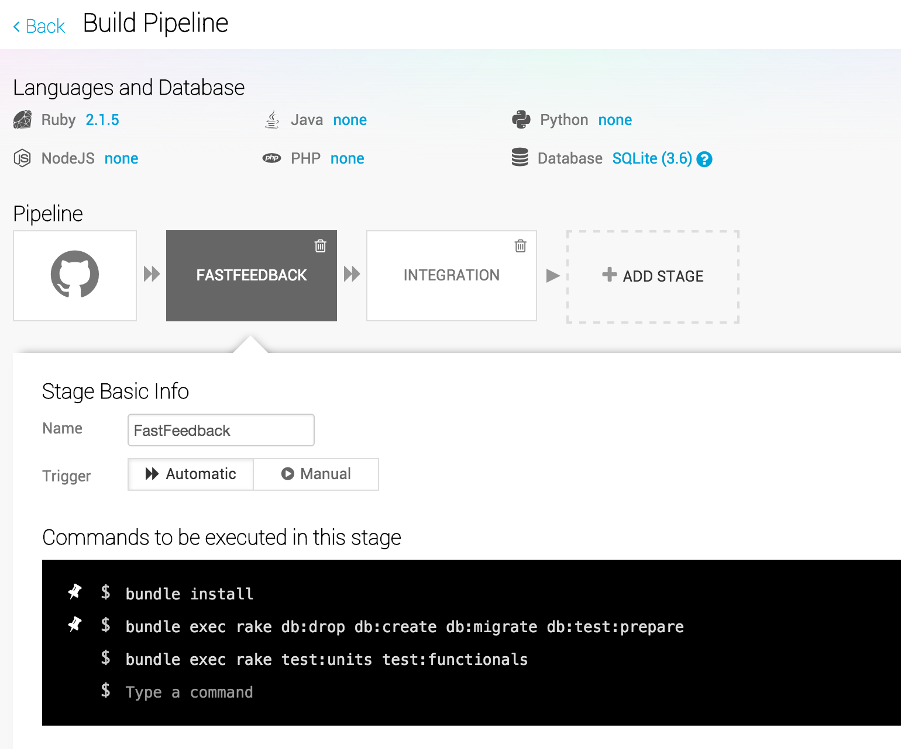
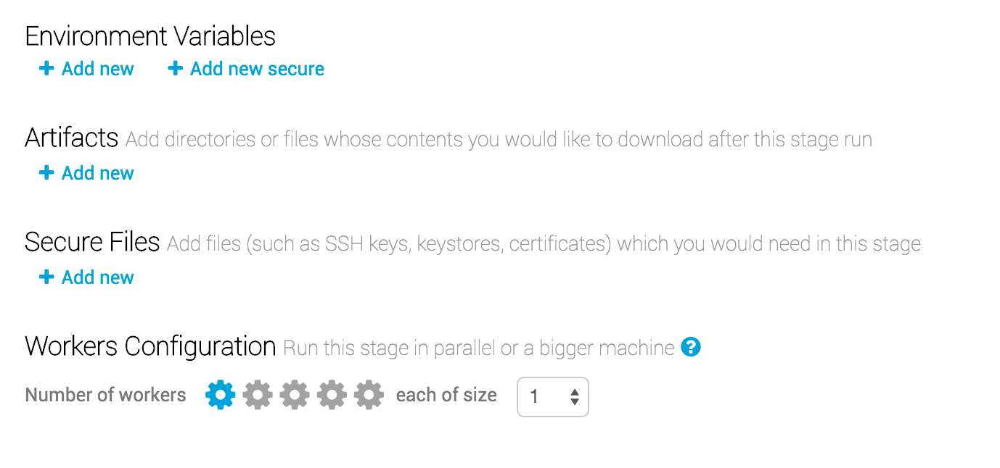
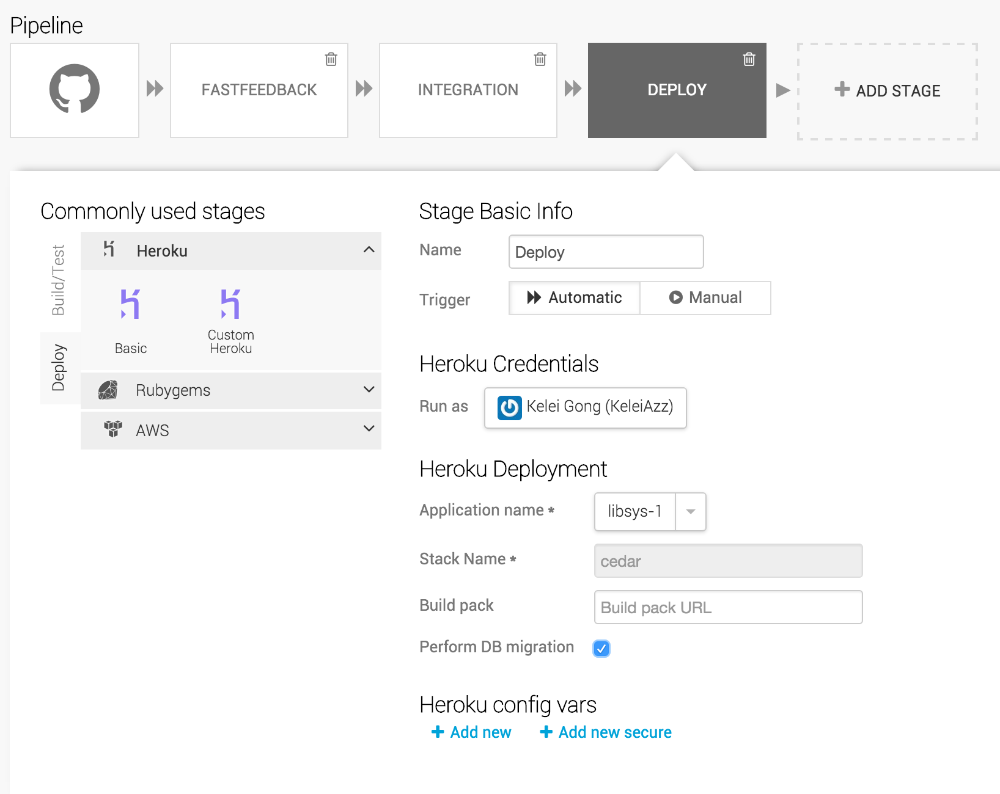
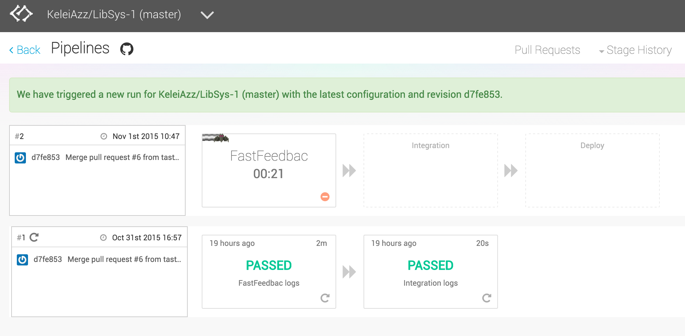
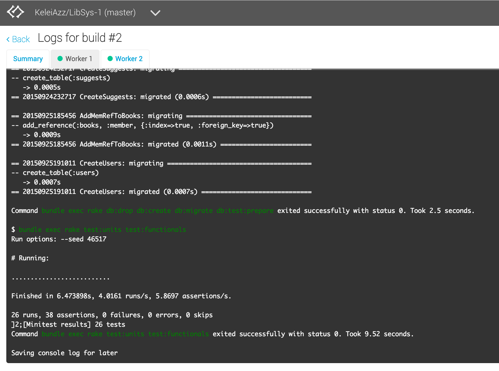
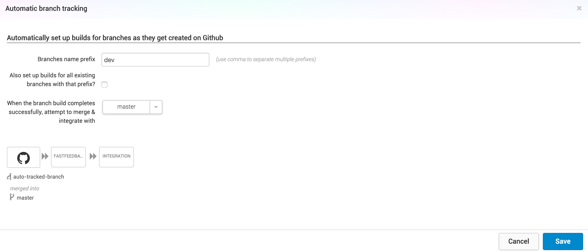
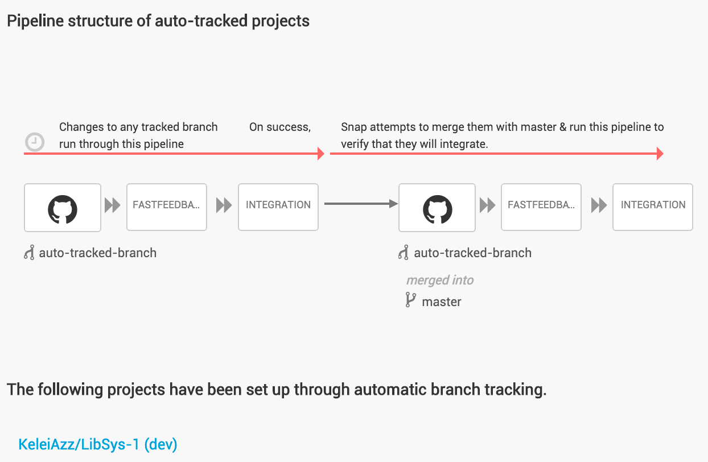
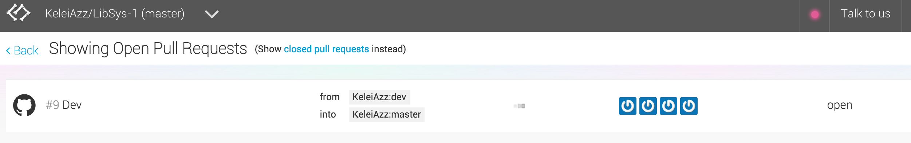
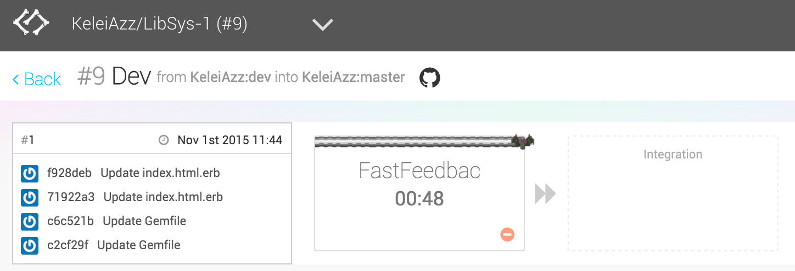
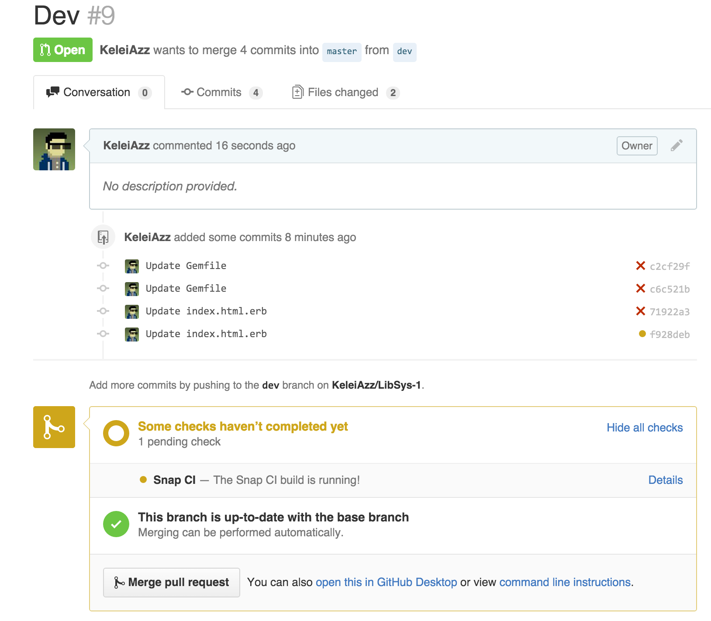

##DevOps TechTalk - Snap CI
---
###Team Members:
* Kelei Gong
* Ying Huang
* Shanil Puri
* Shengpei Zhang

### Demo
[video](https://drive.google.com/file/d/0B87f7178bIHnX08wRmFOZl9uLW8/view?usp=sharing)
[slides](https://docs.google.com/presentation/d/1ycscxHwlHiRSbv9tKpJLLXmphNAAxStxDyeYeBX8VeA/edit#slide=id.p)
##Setup
###Add a repository
Login to [Snap CI](https://snap-ci.com/), GitHub will ask if you want to give a set of permissions to Snap. Snap will present a list of all the repositories you have access to, and then you can add a repository to Snap
###Configure the build steps
After adding the repository to Snap, it will clone the repository form Github to its cloud server, and then we can customize the build steps for this repository.

Snap will attempt to automatically detect some popular configurations for the build. It looks for languages versions, build tools files, dependency managers and other conventions that may indicate how the build could be set up.

For example, if we import a Rails project, it will get the language version and database type, then automatically create two steps for pipeline: FastFeedBack and Integration.

 

In this example, it will run the basic setup for the Rails project, follows by unit test and functional test. We can customize this step by changing the commands to be executed, and add more stages to the pipeline. The stage trigger can be set to be either automatic or manual.  

Some additional settings like `Environment Variables` and `Secure Files` can give us more control over the building steps. And an important feature of Snap is that we can set the number of workers and the worker's size of this stage, thus it can run this stage in parallel or run multiple pipelines in parallel. One way of taking advantage of this is to run tests in parallel across multiple workers. And with larger size workers be useful in cases where the stage requires more memory to build.

###Add a Deploy stage
Besides the building and testing parts in the pipeline, we can also add a Deploy stage, here we take deploy to Heroku as an example.

The configuration is quite easy, it will redirect you to Heroku and ask for authorization, then choose an application name and check the perform DB migration if it's a production stage. At last, You can optionally setup heroku configuration variables from Snap by navigating to the `Heroku Config Variables` tab

##Running the pipeline
###Basic usage
Upon finishing all the settings, we can start running the building pipeline. Any changes in the current branch will trigger a build, and followed by the deployment. The building process looks like this, it has a nice GUI to show the process of each stage, and we can click a stage to view it's console output, thus can make us have more aware of what is going on.

And we can see from the picture below, in this build it has two workers, in this way it can run the unit test and functional test in a parallel way.

###Branch tracking
By default Snap tracks master branch, but it can be setup to track any other branches.This helps resolve merge conflicts early. It will always tells status of branch with current base branch. 

In the `Automatic branch tracking` setting page, we can set branches with a certain prefix to be tracked, when changes are made to the tracked branches and an integration branch target (in this case the master branch), which will be used to set up an integration pipeline. Snap will run the same pipeline as master branch but without the deploy step. And when the build and test complete successfully, it will try to merge it to the master branch and run the build pipeline again.

###Pull requests
For any repository that is building on Snap CI, creating a new pull request on GitHub will create a project in Snap that will actively track that pull request, and update the status on the pull request on GitHub.

Once a pull request is created, it will trigger a build in Snap, and the build pipeline is identical to the master branch. 

We can view the status of this pull request in Github pull request page:

##Reference
* https://docs.snap-ci.com/getting-started/
